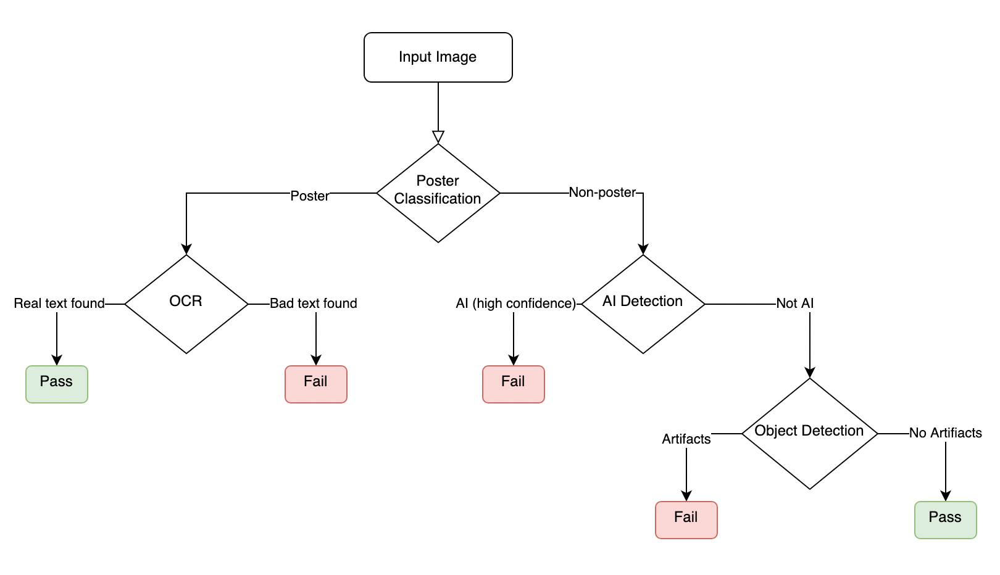

# WatchdogAI

Jorge Bris Moreno, Thomas Sigall, and Brian Kwon

## Project Overview
This is our project overview.



## Preparation
### Models
All models are included in the `models` folder except our Vision Tranformer model, which is in the `models/non_poster_model` folder. You can find this model in [Google Drive.](https://drive.google.com/drive/folders/1J1krRM3kfUSVaP0U3bMoJQiq7d_AOskN?usp=sharing)

## Usage
You can use our pipeline by running the following command:
```{bash}
python detection_pipeline.py <path_to_image>
```

or with custom threshold values:

```{bash}
python detection_pipeline.py <path_to_image> --poster_threshold <value> --ai_threshold <value>
```

## Structure

🚫 - Part of .gitignore and/or not included in the repo
```
.
├── 📁 images  
├── 📁 data (🚫)     
├── 📁 models
│   ├── 📁 AIDetectorResNet           
│   ├── 📁 Simple3BlockCNN     
│   ├── 📁 SimpleResNetCNN      
│   ├── 📁 non_poster_model (🚫) 
│   └── 📁 htc_r50_artifact_final           
├── 📁 AI_Detection
├── 📁 Poster_Detection
├── 📁 Object_Detection
├── 📁 src
│   ├── ...
│   └── detectors.py
├── .gitattributes
├── .gitignore
├── detection_pipeline.py        ---> Our pipeline                
├── report.qmd
└── README.md                                            
```
